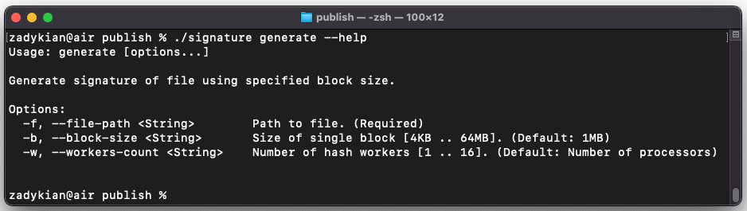

## FileSignature
Console application to generate file signature.
It's being published as a single-file trimmed executable.

#### dotnet-cli publish command (.NET 6+ SDK is required):
```
dotnet publish src/FileSignature.App --configuration release --runtime [win-x64|linux-x64|osx-x64] --self-contained --output publish
```

### Usage
Signature app has a convenient command-line interface. To display information about usage, execute `--help` command.


`generate` command produces list of SHA256 hash codes - one for each segment of specified file.

#### LogLevel can be changed via environment variable:
```
export Logging__LogLevel__Default=[Trace|Information|Error|...]
```